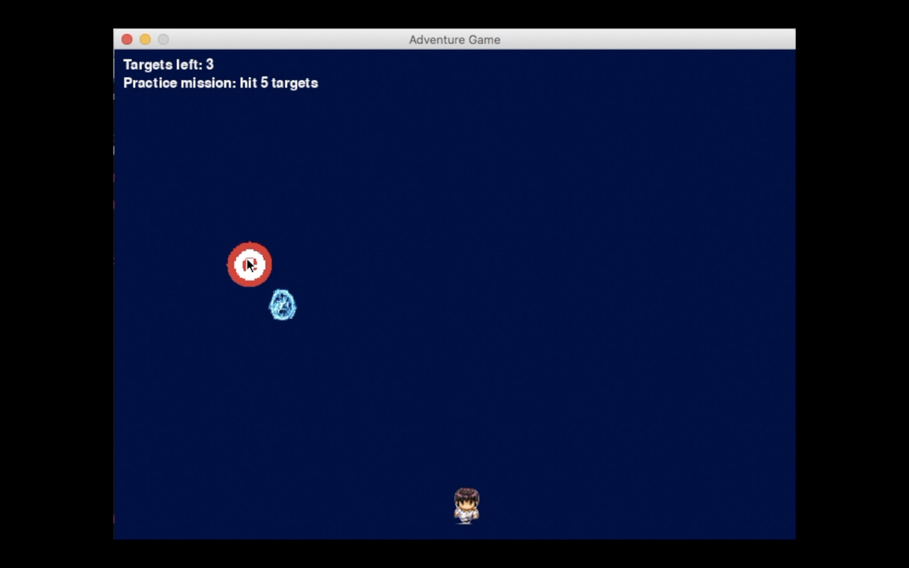

# Impossible-Game
Making a fun and intensize RPG game to play in your free time!

Made by Jeffrey Zhou.

# Demo

|  |  |
|---------------------------------------------|---------------------------------------------|
|  |  |

# Controls
|              | Button              |
|--------------|---------------------|
| Move Up    | <kbd>W</kbd>     |
| Move Down   | <kbd>A</kbd>    |
| Move Left | <kbd>S</kbd> |
| Move Right    | <kbd>D</kbd>      |
| Shoot    | <kbd>Space</kbd>      |

# Usage
In the terminal run `pip install pygame`. This is necessary to use the imported pygame library which is used in the impossible rpg game. The input file is `impossiblerpg.py`.

Build:
```rs
cargo build --release
```
Run:
```rs
cargo run
```
